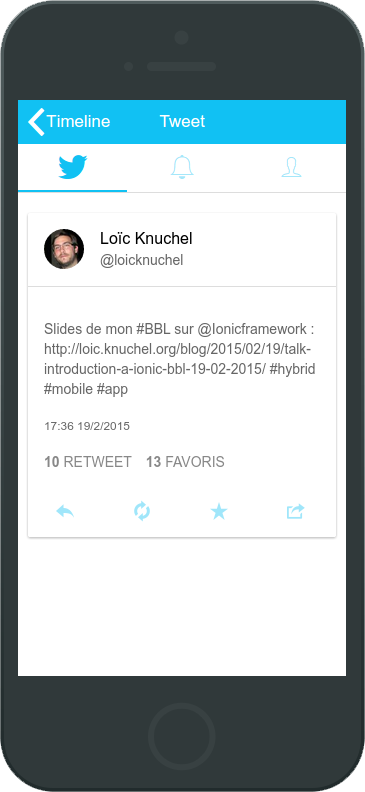

# Twitter app

Ionic composant tour building a twitter client.

Find explications on my [blog post](http://loic.knuchel.org/blog/2015/02/26/faire-un-client-twitter-avec-ionic/) (french).

App Screenshot :

## Getting started

- [Install Ionic](http://ionicframework.com/getting-started/)
- `git clone https://github.com/loicknuchel/blog-twitter-app` : Clone this repo
- `cd blog-twitter-app && ionic serve` : launch app on desktop
- go to [http://127.0.0.1:8100/](http://127.0.0.1:8100/)

Run on device :

- `ionic plugin add org.apache.cordova.device org.apache.cordova.console com.ionic.keyboard` : add standard plugins
- `ionic add platform [android/ios]` : app wanted platform
- `ionic run android` : run on your device (will launch emulator if device is not found)
